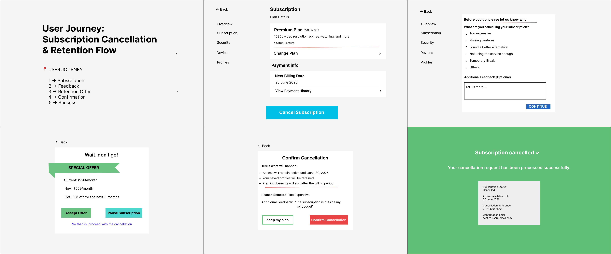
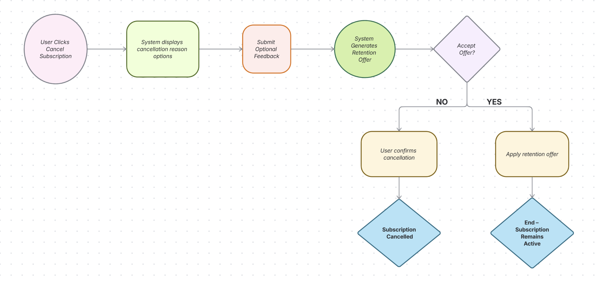
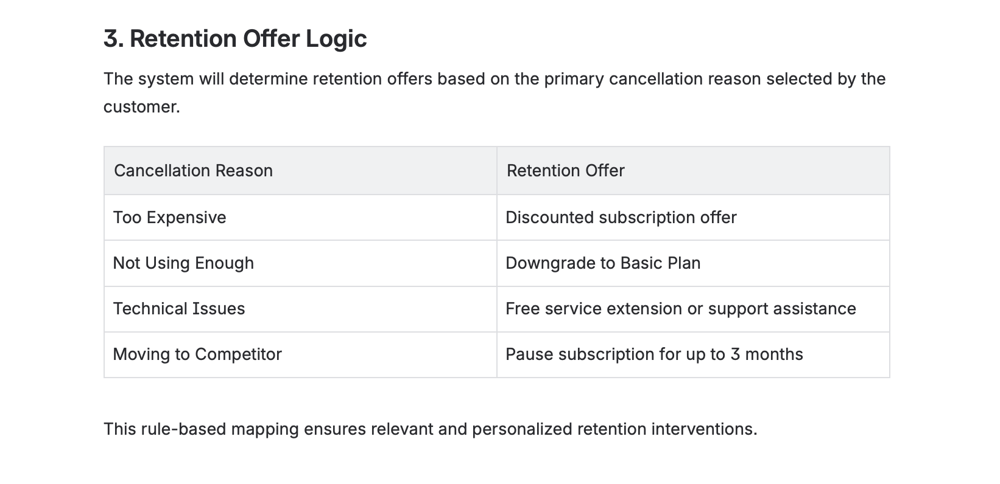
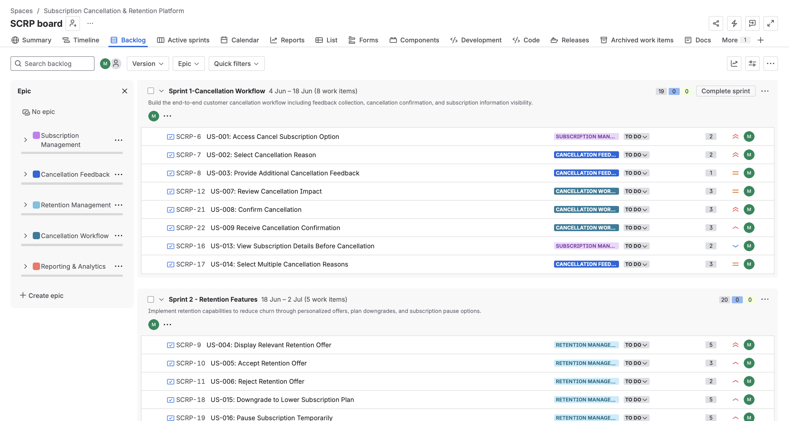
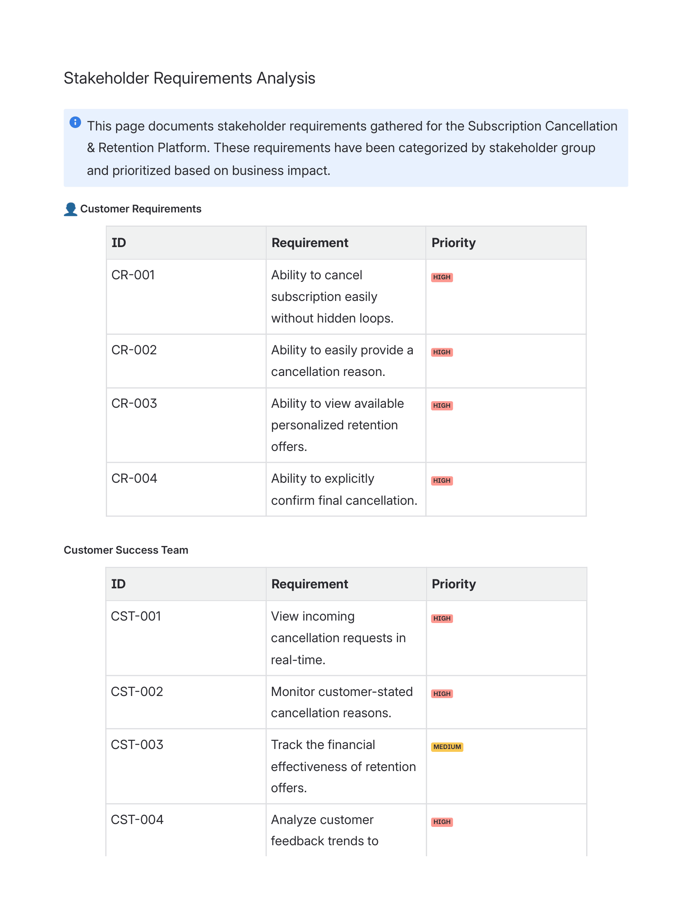

# Subscription Cancellation Retention Platform (SCRP)
`Business Analysis` `BRD` `FRD` `Agile` `Jira` `Confluence` `Figma` `User Stories`

An end-to-end Business Analysis case study focused on reducing customer churn through a structured subscription cancellation journey, personalized retention strategies, and Agile product planning.

⸻

## 📌 Project Overview

Subscription-based businesses often struggle with customer churn due to ineffective cancellation experiences and limited visibility into why users leave. This project proposes a redesigned Subscription Cancellation & Retention Platform (SCRP) that captures meaningful feedback, provides personalized retention offers, and enables business teams to make data-driven decisions.

The solution combines business analysis, stakeholder management, functional documentation, Agile planning, and UI prototyping into a complete product design.

⸻

## 🎯 Business Problem

Traditional cancellation flows often:

* Fail to capture actionable customer feedback
* Offer the same experience to every user regardless of cancellation reason
* Miss opportunities to retain customers through targeted interventions
* Provide limited analytical insights into churn behavior

As a result, businesses lose valuable customers without understanding the underlying causes or attempting personalized recovery strategies.

⸻

## 💡 Proposed Solution

The Subscription Cancellation & Retention Platform introduces a rule-based cancellation workflow that:

* Collects structured cancellation reasons and optional customer feedback
* Dynamically generates personalized retention offers based on user intent
* Allows customers to downgrade or pause subscriptions instead of cancelling
* Records customer behavior for future reporting and business analysis
* Supports data-driven churn reduction strategies

⸻

## 👩‍💼 My Role

As the Business Analyst, I was responsible for:

* Gathering and documenting business requirements
* Creating the Business Requirements Document (BRD)
* Preparing the Functional Requirements Document (FRD)
* Conducting stakeholder requirements analysis
* Writing user stories and acceptance criteria
* Planning Agile sprints and backlog prioritization
* Designing wireframes and interactive prototypes in Figma
* Defining retention business rules and cancellation workflows
* Translating business objectives into product requirements

⸻

## 🔄 User Journey

The following prototype demonstrates the complete customer journey from initiating cancellation to either accepting a retention offer or completing cancellation.

<p align="center">
  
</p>

⸻

## ⚙️ Cancellation Workflow

The business process follows a structured decision flow to ensure every cancellation request captures meaningful insights while maximizing retention opportunities.

<p align="center">
  
</p>

⸻

## 🎁 Retention Offer Logic

Retention offers are generated dynamically based on the customer's primary cancellation reason. The following rule-based mapping demonstrates how personalized interventions are used to reduce churn.

<p align="center">
  
</p>

⸻

## 📋 Agile Planning & Sprint Management

The project follows Agile principles by organizing functionality into prioritized user stories and sprint backlogs.

Development was divided into multiple sprints covering:

* Cancellation Workflow
* Retention Features
* Reporting & Analytics
  
<p align="center">
  
</p>

⸻

## 👥 Stakeholder Requirements Analysis

Requirements were gathered and prioritized across multiple stakeholder groups including:

* Customers
* Customer Success Team
* Marketing Team
* Product Management
* Executive Leadership

This ensured that both business objectives and user needs were incorporated into the final solution.

<p align="center">
  
</p>

⸻

## 📂 Project Documentation

| Document | Link |
|----------|------|
| Project Overview | [View PDF](docs/Project%20Overview.pdf) |
| Business Requirements Document (BRD) | [View PDF](docs/BRD.pdf) |
| Functional Requirements Document (FRD) | [View PDF](docs/FRD.pdf) |
| Stakeholder Requirements Analysis | [View PDF](docs/Stakeholder%20Requirements%20Analysis.pdf) |
| User Stories | [View PDF](docs/User-stories.pdf) |
| Agile Planning | [View PDF](docs/Agile-Planning.pdf) |
| Wireframes & Prototypes | [View PDF](docs/Wireframes-&-Prototypes.pdf) |

⸻

## 🛠️ Tools & Methodologies

Business Analysis

* Business Requirements Gathering
* Functional Requirements Documentation
* Stakeholder Analysis
* Process Mapping
* User Story Creation
* Acceptance Criteria Definition

Product & Design

* Figma
* Wireframing
* UI Prototyping

Agile

* Scrum
* Sprint Planning
* Product Backlog Management
* Jira

Documentation

* Confluence
* Markdown
* PDF Documentation

⸻

## 📈 Key Outcomes

* Designed an end-to-end subscription cancellation experience focused on reducing customer churn.
* Introduced rule-based retention strategies tailored to customer cancellation reasons.
* Produced complete business and functional documentation for implementation.
* Structured development through Agile sprint planning and prioritized user stories.
* Created interactive prototypes to validate user experience before development.
* Established a scalable framework for capturing cancellation insights and improving retention decisions.

⸻

## 📁 Repository Structure

```text
subscription-cancellation-retention-platform/
├── docs/
│   ├── Agile-Planning.pdf
│   ├── BRD.pdf
│   ├── FRD.pdf
│   ├── Project-Overview.pdf
│   ├── Stakeholder-Requirements-Analysis.pdf
│   ├── User-Stories.pdf
│   └── Wireframes-&-Prototypes.pdf
│
├── images/
│   ├── agile-backlog.png
│   ├── cancellation-workflow.png
│   ├── prototype-flow.png
│   ├── retention-logic.png
│   └── stakeholder-analysis.png
│
└── README.md
```
⸻

